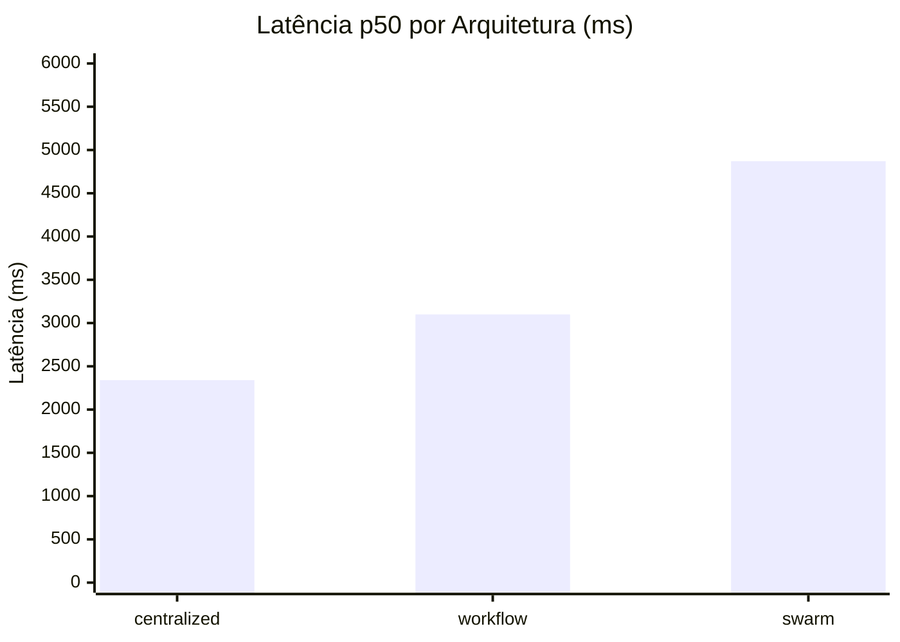
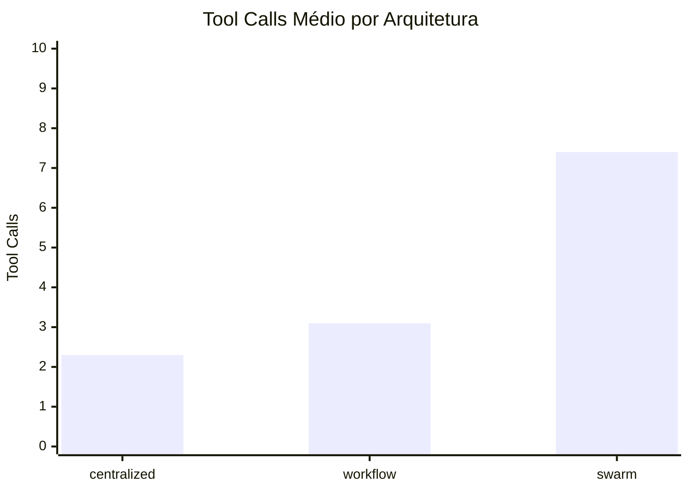

# 02 — Benchmark Runner para Comparação de Arquiteturas

> **Melhoria**: Modernizar `scripts/run_architecture_benchmark.py` para usar o framework `tests/e2e-quality/` (httpx + YAML + pytest), coletar métricas detalhadas por run, e gerar relatório markdown comparativo entre as 3 arquiteturas.

---

## Sumário

1. [Contexto e Motivação](#1-contexto-e-motivação)
2. [Estado Atual](#2-estado-atual)
3. [Estado Desejado](#3-estado-desejado)
4. [Design Técnico](#4-design-técnico)
5. [Layout do Relatório Markdown](#5-layout-do-relatório-markdown)
6. [Como Validar](#6-como-validar)
7. [Implementação Passo a Passo](#7-implementação-passo-a-passo)
8. [Riscos e Mitigações](#8-riscos-e-mitigações)
9. [Critérios de Pronto](#9-critérios-de-pronto)
10. [Fora de Escopo](#10-fora-de-escopo)

---

## 1. Contexto e Motivação

O objetivo central do TCC é **comparar três arquiteturas de coordenação multi-agente** aplicadas ao atendimento farmacêutico:

| Arquitetura | Descrição |
|---|---|
| `centralized_orchestration` | Orquestrador central roteia todas as decisões |
| `structured_workflow` | Pipelines predefinidos com agentes especializados |
| `decentralized_swarm` | Colaboração peer-to-peer entre agentes |

Para defender a tese com rigor, precisamos de **números comparativos reproduzíveis**: latência, consumo de tokens, quantidade de tool calls, taxa de handoffs, taxa de review humano e taxa de sucesso. A POC já possui o mecanismo inicial (`scripts/run_architecture_benchmark.py`), mas ele:

- Usa `urllib` (stdlib) em vez do `httpx` já adotado no framework de testes
- Lê cenários JSON de `packages/test-fixtures/scenarios/` em vez dos YAML de `tests/e2e-quality/scenarios/`
- Não coleta métricas granulares (tokens, handoffs, tool errors)
- Não gera agregações estatísticas (p50, p95, stddev)
- Não produz gráficos comparativos

Esta melhoria unifica o benchmark no framework moderno e produz artefatos prontos para inclusão no capítulo de resultados do TCC.

---

## 2. Estado Atual

### 2.1 Script legado: `scripts/run_architecture_benchmark.py`

O script atual (linhas 1–40) importa helpers de `run_fixture_scenarios` e faz o produto cartesiano `ARCHITECTURES × scenarios`:

```python
# scripts/run_architecture_benchmark.py — linhas 1-20
from run_fixture_scenarios import (
    create_conversation,   # urllib-based
    load_scenarios,        # lê JSON de packages/test-fixtures/scenarios/*.json
    poll_conversation,     # polling com urllib
    send_message,          # multipart manual com urllib
)

REPORT_ROOT = ROOT / "var" / "reports" / "runtime" / "T11"
ARCHITECTURES = [
    "centralized_orchestration",
    "structured_workflow",
    "decentralized_swarm",
]
```

A função `summarize_result` (linhas 72–87) extrai métricas limitadas do `detail`:

```python
# scripts/run_architecture_benchmark.py — linhas 72-87
def summarize_result(architecture, scenario, status_code, detail):
    latest_run = (detail or {}).get("runs", [{}])[-1] if detail else {}
    return {
        "architecture": architecture,
        "scenarioId": scenario["id"],
        "totalDurationMs": latest_run.get("totalDurationMs"),
        "toolCallCount": (latest_run.get("summary") or {}).get("toolCallCount"),
        "loopCount": (latest_run.get("summary") or {}).get("loopCount"),
        "humanReviewRequired": latest_run.get("humanReviewRequired"),
    }
```

O relatório gerado (`render_markdown_report`, linhas 90–110) é uma tabela flat sem agregações:

```
| Architecture | Scenario | Status | Duration (ms) | Tool Calls | Loops | Review |
```

**Output**: `var/reports/runtime/T11/<timestamp>/benchmark-results.json` + `final-benchmark-report.md`

### 2.2 Framework moderno: `tests/e2e-quality/`

Em paralelo, o framework de qualidade E2E já resolve os mesmos problemas de forma superior:

| Aspecto | Script legado | Framework E2E |
|---|---|---|
| HTTP client | `urllib.request` (stdlib) | `httpx.Client` com streaming SSE |
| Cenários | JSON em `packages/test-fixtures/scenarios/` | YAML em `tests/e2e-quality/scenarios/` |
| Expansão por arquitetura | Manual no loop do benchmark | `defaults.architectures` no YAML |
| Coleta de eventos | Polling com `poll_conversation` | SSE streaming com `wait_for_event` |
| Asserções | `validate_detail` ad-hoc | pytest parametrizado com `_normalize` |

### 2.3 Duplicação identificada

Existem **duas coleções de casos de teste** que descrevem os mesmos cenários:

- `packages/test-fixtures/scenarios/*.json` — 6 fixtures JSON (faq, stock, product-image, document-pdf, human-review, invalid-attachment)
- `tests/e2e-quality/scenarios/pharmacy.yaml` — cenários YAML com schema mais rico (`response_contains_any`, `actor_reasoning_present`)

E **dois clientes HTTP** que fazem a mesma coisa:

- `scripts/run_fixture_scenarios.py` → `raw_request()` com `urllib`
- `tests/e2e-quality/api_client.py` → `E2EClient` com `httpx`

---

## 3. Estado Desejado

**UM script** `scripts/run_architecture_benchmark.py` (reescrito) + target `make benchmark` que:

### 3.1 Fonte de verdade única

- Lê cenários YAML de `tests/e2e-quality/scenarios/*.yaml`
- Expande por arquitetura usando `defaults.architectures` do YAML (ou override via CLI)
- Reutiliza `E2EClient` de `tests/e2e-quality/api_client.py`

### 3.2 Métricas coletadas por run

Para cada execução (cenário × arquitetura × iteração), coleta:

| Campo | Tipo | Fonte |
|---|---|---|
| `runId` | `str` | `send_message()` response |
| `architectureMode` | `str` | parâmetro de entrada |
| `scenarioId` | `str` | YAML case `id` |
| `route` | `str` | `response.final` payload |
| `finalActor` | `str` | `response.final` payload |
| `latencyMs` | `float` | `time.monotonic()` delta |
| `inputTokens` | `int` | `response.final` payload → `metrics.inputTokens` |
| `outputTokens` | `int` | `response.final` payload → `metrics.outputTokens` |
| `totalTokens` | `int` | `inputTokens + outputTokens` |
| `toolCallCount` | `int` | `response.final` payload → `metrics.toolCallCount` |
| `toolErrorCount` | `int` | `response.final` payload → `metrics.toolErrorCount` |
| `loopCount` | `int` | `response.final` payload → `metrics.loopCount` |
| `handoffCount` | `int` | `response.final` payload → `metrics.handoffCount` |
| `reviewRequired` | `bool` | `response.final` payload |
| `contentText` | `str` | preview (primeiros 120 chars) |
| `success` | `bool` | execução sem exceção |
| `error` | `str \| None` | mensagem de erro se falhou |

### 3.3 Agregações por arquitetura

- p50 / p95 latência
- Média e stddev de tokens totais
- Média de tool calls e tool errors
- Taxa de review (`reviewRequired == True / total`)
- Taxa de sucesso (`success == True / total`)

### 3.4 Saída

| Arquivo | Caminho | Descrição |
|---|---|---|
| `report.md` | `var/reports/benchmark/<timestamp>/report.md` | Relatório markdown com tabelas e gráfico mermaid |
| `runs.json` | `var/reports/benchmark/<timestamp>/runs.json` | Array de `RunMetrics` serializado |
| `runs.csv` | `var/reports/benchmark/<timestamp>/runs.csv` | CSV para import em planilha ou Jupyter |

> **Nota**: o output vai em `var/reports/benchmark/` — separado do legado `var/reports/runtime/T11/`.

---

## 4. Design Técnico

### 4.1 Estrutura de arquivos

```
scripts/
  run_architecture_benchmark.py    # entry point CLI (reescrito)

tests/e2e-quality/
  api_client.py                    # E2EClient (existente, sem alteração)
  _loader.py                       # NOVO: YAML loader extraído do conftest
  conftest.py                      # refatorado para usar _loader.py
  scenarios/
    pharmacy.yaml                  # fonte de verdade dos cenários
```

### 4.2 Dataclass `RunMetrics`

```python
from __future__ import annotations
from dataclasses import dataclass, field, asdict
from typing import Optional

@dataclass(frozen=True)
class RunMetrics:
    """Métricas coletadas de uma única execução (cenário × arquitetura × iteração)."""

    # Identificação
    run_id: str
    architecture_mode: str
    scenario_id: str
    iteration: int

    # Roteamento
    route: Optional[str] = None
    final_actor: Optional[str] = None

    # Performance
    latency_ms: float = 0.0

    # Tokens
    input_tokens: int = 0
    output_tokens: int = 0
    total_tokens: int = 0

    # Complexidade
    tool_call_count: int = 0
    tool_error_count: int = 0
    loop_count: int = 0
    handoff_count: int = 0

    # Qualidade
    review_required: bool = False
    content_text: str = ""          # preview, max 120 chars

    # Status
    success: bool = True
    error: Optional[str] = None
```

### 4.3 CLI flags

```
python scripts/run_architecture_benchmark.py [OPTIONS]

Opções:
  --architectures   Arquiteturas a testar (default: cent,work,swarm)
                    Aliases: cent → centralized_orchestration
                             work → structured_workflow
                             swarm → decentralized_swarm
  --scenarios       IDs de cenários a rodar (default: todos do YAML)
  --iterations      Repetições por combinação (default: 1)
  --live            Ativa modo live LLM (seta ENABLE_LIVE_LLM=true no header)
  --output-dir      Diretório de saída (default: var/reports/benchmark/<timestamp>)
  --api-base        URL base da API (default: http://127.0.0.1:8000)
  --timeout         Timeout por execução em segundos (default: 60)
```

### 4.4 Fluxo de execução

```
1. Parse CLI args
2. Carregar cenários YAML via _loader.load_scenarios()
3. Filtrar por --scenarios se especificado
4. Expandir: scenarios × architectures × iterations
5. Para cada combinação:
   a. client.create_conversation(metadata={architectureMode: arch})
   b. t0 = time.monotonic()
   c. msg = client.send_message(conversation_id, text, metadata)
   d. final_event = client.wait_for_event(conversation_id, 'response.final', timeout)
   e. latency_ms = (time.monotonic() - t0) * 1000
   f. Extrair métricas do final_event.payload
   g. Construir RunMetrics
   h. Throttle: sleep(1.0) se --live
6. Agregar por arquitetura
7. Gerar report.md + runs.json + runs.csv
```

### 4.5 Coleta de métricas do `response.final`

O evento `response.final` emitido pelo runtime contém o payload com as métricas:

```python
payload = final_event.get("payload", {})

# Métricas diretas
metrics = payload.get("metrics", {})
route = payload.get("route")
final_actor = payload.get("finalActor")
review_required = payload.get("reviewRequired", False)
content_text = (payload.get("contentText") or "")[:120]

# Tokens e complexidade
input_tokens = metrics.get("inputTokens", 0)
output_tokens = metrics.get("outputTokens", 0)
tool_call_count = metrics.get("toolCallCount", 0)
tool_error_count = metrics.get("toolErrorCount", 0)
loop_count = metrics.get("loopCount", 0)
handoff_count = metrics.get("handoffCount", 0)
```

### 4.6 Makefile targets

```makefile
# ── Benchmark ────────────────────────────────────────────────────────
benchmark:
	python scripts/run_architecture_benchmark.py \
		--architectures cent,work,swarm \
		--iterations 1

benchmark-live:
	python scripts/run_architecture_benchmark.py \
		--architectures cent,work,swarm \
		--iterations 3 \
		--live
```

---

## 5. Layout do Relatório Markdown

Exemplo completo com valores hipotéticos plausíveis:

````markdown
# Benchmark Report — Multi-Agent Bench

| Meta | Valor |
|---|---|
| Data | 2026-05-15T14:32:00Z |
| Commit | `a3f8c1d` |
| Modo | 🔴 Live LLM (Bedrock) |
| Arquiteturas | 3 |
| Cenários | 2 |
| Iterações | 3 |
| Total de execuções | 18 |

---

## Resumo por Arquitetura

| Arquitetura | p50 Latência | p95 Latência | Avg Tokens | Avg Tool Calls | Avg Handoffs | Review Rate | Success Rate |
|---|---:|---:|---:|---:|---:|---:|---:|
| centralized_orchestration | 2,340 ms | 3,120 ms | 1,250 | 2.3 | 0.0 | 0% | 100% |
| structured_workflow | 3,100 ms | 4,580 ms | 1,480 | 3.1 | 1.3 | 0% | 100% |
| decentralized_swarm | 4,870 ms | 7,210 ms | 2,150 | 7.4 | 3.7 | 17% | 83% |

---

## Detalhamento por Cenário

### dipirona_dor_de_cabeca

| Métrica | centralized | workflow | swarm |
|---|---:|---:|---:|
| p50 Latência (ms) | 2,180 | 2,950 | 4,520 |
| Avg Input Tokens | 420 | 510 | 780 |
| Avg Output Tokens | 830 | 970 | 1,370 |
| Avg Tool Calls | 2.0 | 3.0 | 6.7 |
| Avg Tool Errors | 0.0 | 0.0 | 0.3 |
| Avg Handoffs | 0.0 | 1.0 | 3.3 |
| Review Rate | 0% | 0% | 33% |
| Success Rate | 100% | 100% | 100% |

### consulta_estoque_ibuprofeno

| Métrica | centralized | workflow | swarm |
|---|---:|---:|---:|
| p50 Latência (ms) | 2,500 | 3,250 | 5,220 |
| Avg Input Tokens | 380 | 460 | 720 |
| Avg Output Tokens | 870 | 1,020 | 1,430 |
| Avg Tool Calls | 2.7 | 3.3 | 8.0 |
| Avg Tool Errors | 0.0 | 0.3 | 0.7 |
| Avg Handoffs | 0.0 | 1.7 | 4.0 |
| Review Rate | 0% | 0% | 0% |
| Success Rate | 100% | 100% | 67% |

---

## Observações Automáticas

- 🏎️ **centralized_orchestration** teve a menor latência p50 (2,340 ms) — 2.1x mais rápido que swarm
- 🔧 **decentralized_swarm** usou 3.2x mais tool calls que centralized em média (7.4 vs 2.3)
- 🔀 **decentralized_swarm** realizou 3.7 handoffs em média; centralized não realizou nenhum
- 🔴 **decentralized_swarm** teve a menor taxa de sucesso (83%) e a maior taxa de review (17%)
- 📊 **structured_workflow** ficou no meio-termo em todas as métricas

---

## Gráfico — Latência p50 por Arquitetura (ms)



## Gráfico — Tool Calls Médio por Arquitetura


````

---

## 6. Como Validar

### 6.1 Smoke test em modo mock

```bash
make benchmark
# Expectativa:
#   - 3 arquiteturas × 1 cenário (dipirona) × 1 iteração = 3 execuções
#   - Termina em < 30s
#   - Gera var/reports/benchmark/<timestamp>/report.md
#   - Gera var/reports/benchmark/<timestamp>/runs.json
#   - Gera var/reports/benchmark/<timestamp>/runs.csv
#   - Todos os runs com success=true
#   - Latências triviais (< 500ms em mock)
```

### 6.2 Teste live com LLM real

```bash
make benchmark-live
# Expectativa:
#   - 3 arquiteturas × 1 cenário × 3 iterações = 9 execuções
#   - Termina em ~90s (throttle de 1 req/s)
#   - Latências reais (1-8s dependendo da arquitetura)
#   - centralized mais rápido, swarm mais tool calls
#   - Tokens > 0 para todas as execuções
```

### 6.3 Snapshot test do formato

```bash
# Teste opcional: verificar que o formato do report não regrediu
diff <(head -20 var/reports/benchmark/latest/report.md) \
     tests/e2e-quality/snapshots/expected-report-header.md
```

### 6.4 Comparação com script antigo

O novo `RunMetrics` preserva todos os campos do legado `summarize_result` (linhas 72–87):

- ✅ `architecture` → `architecture_mode`, `scenarioId` → `scenario_id`, `totalDurationMs` → `latency_ms`, `toolCallCount` → `tool_call_count`, `loopCount` → `loop_count`, `humanReviewRequired` → `review_required`, `runId` → `run_id`
- ⚠️ Removidos: `runStatus` (redundante com `success`), `traceId` (disponível via OTEL)
- 🆕 Novos: `input_tokens`, `output_tokens`, `handoff_count`, `tool_error_count`, `final_actor`, `content_text`

---

## 7. Implementação Passo a Passo

### Passo A — Extrair YAML loader para `_loader.py`

Extrair `_load_scenarios()` de `conftest.py` (linhas 22–55) para `tests/e2e-quality/_loader.py`. Exporta `load_yaml_scenarios(scenarios_dir, selected_ids=None, architectures_override=None)`. O `conftest.py` passa a importar de `_loader`.

### Passo B — Criar `benchmark_client.py`

Criar `tests/e2e-quality/benchmark_client.py` com classe `BenchmarkClient` que compõe `E2EClient` e expõe:

```python
def run_and_collect(self, case: dict, architecture: str, iteration: int, timeout: float) -> RunMetrics:
    """Executa cenário completo: create_conversation → send_message → wait_for_event → extrair métricas."""
```

### Passo C — Reescrever `scripts/run_architecture_benchmark.py`

Entry point CLI com `argparse`. Responsabilidades: parse args → instanciar `BenchmarkClient` → carregar cenários via `_loader` → loop `scenarios × architectures × iterations` → coletar `list[RunMetrics]` → agregar estatísticas → gerar `report.md` + `runs.json` + `runs.csv`.

### Passo D — Depreciar `scripts/run_fixture_scenarios.py`

Manter por compatibilidade, adicionar warning no `main()`:

```python
warnings.warn(
    "run_fixture_scenarios.py está depreciado. Use 'make test-quality' ou 'make benchmark'.",
    DeprecationWarning, stacklevel=2,
)
```

### Passo E — Adicionar targets ao Makefile

Adicionar após `# ── E2E Quality Tests`:

```makefile
benchmark:
	python scripts/run_architecture_benchmark.py --architectures cent,work,swarm --iterations 1

benchmark-live:
	python scripts/run_architecture_benchmark.py --architectures cent,work,swarm --iterations 3 --live
```

---

## 8. Riscos e Mitigações

| Risco | Impacto | Probabilidade | Mitigação |
|---|---|---|---|
| **Custo de Bedrock** em modo live | Alto ($$) | Média | Default `--iterations=1`; cache de prompts por hash do texto de entrada; budget alert na conta AWS |
| **Throttling da API AWS** | Médio (runs falham) | Alta com muitas iterações | Throttle interno de 1 req/s em modo `--live`; retry com backoff exponencial (max 3) |
| **Variação de latência** entre runs | Médio (dados ruidosos) | Alta | Rodar K iterações (default 3 em live); reportar média + stddev + p50/p95; descartar outliers > 3σ |
| **Mock não reflete realidade** | Baixo (esperado) | Certa | Documentar claramente no report se é mock ou live; mock serve apenas para validar o pipeline |
| **Cenários YAML insuficientes** | Médio (benchmark fraco) | Média | Expandir `pharmacy.yaml` com mais cases antes de rodar live; mínimo 6 cenários para o TCC |
| **Formato do `response.final` muda** | Médio (métricas zeradas) | Baixa | Fallback para 0 em campos ausentes; log warning quando campo esperado não existe |

---

## 9. Critérios de Pronto

- [ ] `make benchmark` produz `report.md` com as 3 arquiteturas em `var/reports/benchmark/<timestamp>/`
- [ ] Números são reproduzíveis em modo mock (latências < 500ms, tokens = 0, tool calls determinísticos)
- [ ] Em modo live, 3 arquiteturas × 6 cenários × 1 iteração completa em < 5 min
- [ ] `runs.json` contém array de objetos com todos os campos de `RunMetrics`
- [ ] `runs.csv` é importável em Google Sheets / Jupyter sem ajustes
- [ ] Relatório distingue visualmente onde cada arquitetura é melhor (observações automáticas)
- [ ] Gráficos mermaid renderizam corretamente no GitHub
- [ ] `conftest.py` usa `_loader.py` sem regressão nos testes existentes (`make test-quality` passa)
- [ ] `scripts/run_fixture_scenarios.py` emite `DeprecationWarning` mas continua funcional

---

## 10. Fora de Escopo

| Item | Motivo | Onde será tratado |
|---|---|---|
| Migrar fixtures JSON antigos para YAML | Escopo separado, não bloqueia o benchmark | Melhoria futura |
| Dashboard web de comparação | Depende dos dados do benchmark existirem primeiro | Melhoria 05 |
| Avaliação semântica com deepeval/LLM-as-judge | Complexidade adicional, fase posterior | Melhoria 04 |
| Integração com CI/CD (GitHub Actions) | Requer infra de secrets e Bedrock no CI | Melhoria futura |
| Suporte a cenários com attachments no benchmark | `E2EClient.send_message` não suporta files ainda | Extensão futura do client |
