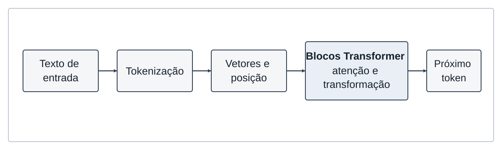
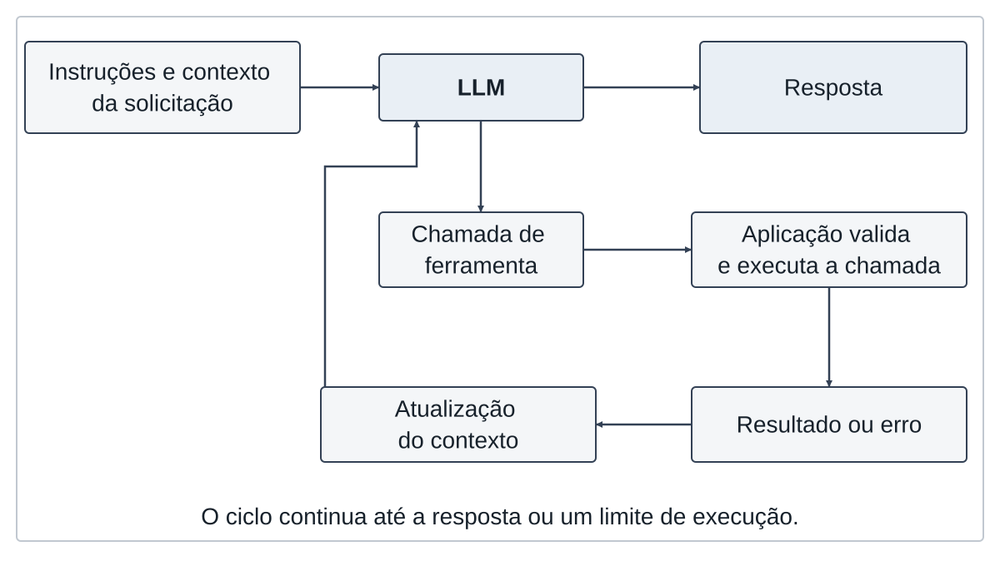
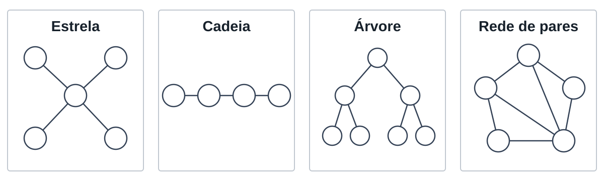
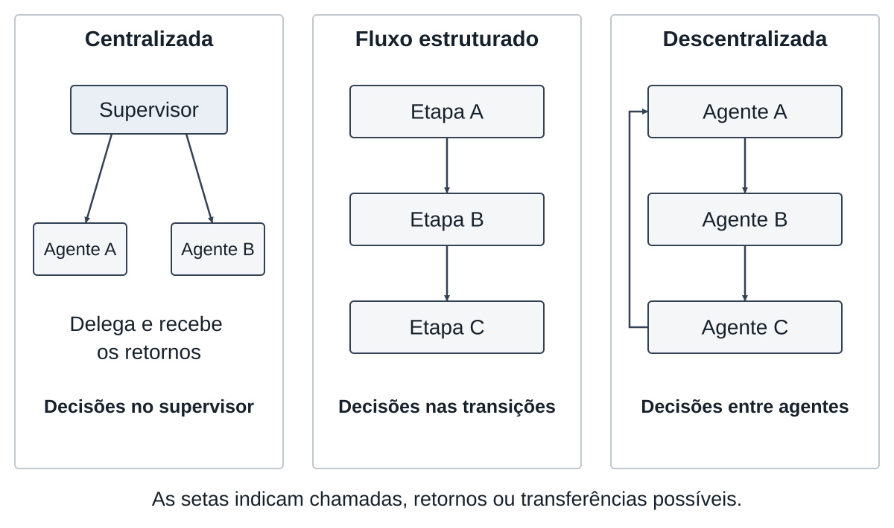

# 2 FUNDAMENTAÇÃO TEÓRICA

Este capítulo reúne os conceitos que fundamentam a análise comparativa das arquiteturas de coordenação. Primeiro, delimita o atendimento em farmácias como estudo de caso e discute o uso de inteligência artificial nesse ambiente. Em seguida, apresenta modelos de linguagem, agentes inteligentes, sistemas multiagentes e as três arquiteturas examinadas neste trabalho.

## 2.1 ATENDIMENTO EM FARMÁCIAS

O atendimento em farmácias combina atividades comerciais, administrativas e de orientação em saúde. A atuação do farmacêutico não se limita à entrega de medicamentos, pois inclui apoiar seu uso seguro e conduzir situações que exigem avaliação profissional (WHO EUROPE, 2024). Para um sistema automatizado, essa variedade exige distinguir tarefas operacionais, baseadas em informações institucionais ou consultas a sistemas, de solicitações clínicas, que dependem do julgamento de um farmacêutico.

Uma pergunta sobre horário de funcionamento pode ser respondida com informação institucional, enquanto uma consulta de disponibilidade depende de uma fonte de estoque. Dúvidas sobre dose, contraindicação ou interação entre medicamentos, por sua vez, requerem análise profissional. Os exemplos apenas ilustram necessidades distintas de informação e encaminhamento; não representam categorias extraídas de conversas reais. A caracterização dos atendimentos será realizada na etapa metodológica prevista para o estudo de caso.

A revisão de Hatzimanolis et al. (2025) identifica aplicações de inteligência artificial em diferentes atividades da prática farmacêutica. A diversidade dos usos encontrados indica que “IA em farmácias” não constitui uma tarefa única: sistemas podem apoiar processos distintos, com dados, riscos e critérios de avaliação próprios. Essa revisão delimita o contexto de aplicação, mas não demonstra que uma arquitetura de coordenação seja superior a outra.

Pais et al. (2024) analisam uma tarefa mais específica: identificar e corrigir instruções potencialmente incorretas sobre medicamentos em uma farmácia digital. O estudo combina modelo de linguagem, regras de domínio, salvaguardas e revisão farmacêutica. Seu escopo não equivale à validação de um sistema automatizado capaz de responder, sem supervisão profissional, a qualquer solicitação de saúde. Na plataforma experimental deste trabalho, denominada MAB (*multi-agent benchmark*), a automação permanece restrita a funções operacionais e ao encaminhamento de casos sensíveis. A farmácia fornece um estudo de caso com diferentes fontes de informação e níveis de risco; o objeto principal da pesquisa é a forma como o controle, a comunicação, o contexto e o encerramento das tarefas são organizados entre os componentes do sistema.

## 2.2 INTELIGÊNCIA ARTIFICIAL NO ATENDIMENTO

No atendimento, técnicas de processamento de linguagem natural podem associar mensagens a intenções, recuperar informações e produzir respostas. Adamopoulou e Moussiades (2020) descrevem sistemas conversacionais de diferentes finalidades e formas de construção. A interface de conversa, portanto, não determina como a resposta é obtida nem quais ações o sistema pode executar.

Um *chatbot* pode seguir regras, recuperar conteúdo de uma base ou utilizar um modelo generativo. Ele também pode acionar funções executadas por um ou mais agentes. Interface conversacional, modelo de linguagem, ferramenta e agente são componentes distintos. A combinação adequada depende da tarefa, das fontes de informação e dos limites de atuação definidos para o atendimento.

No domínio farmacêutico, Hatzimanolis et al. (2025) mostram que as aplicações de IA abrangem atividades diversas e se encontram em diferentes níveis de desenvolvimento. Ong et al. (2025), ao revisar o uso de IA generativa e LLMs para reduzir danos relacionados a medicamentos, agrupam os estudos em identificação de interações, apoio à decisão e farmacovigilância. Os autores também registram a ausência de avaliações prospectivas entre os trabalhos incluídos. Esses achados recomendam cautela ao transferir desempenho experimental para o atendimento real.

Neste estudo, a qualidade do atendimento automatizado envolve adequação à solicitação, correção das informações e encaminhamento quando a resposta depende de avaliação humana. Tempo de resposta e consumo de recursos formam a dimensão operacional. Esses critérios devem ser examinados em conjunto, pois uma resposta fluente pode estar incorreta e uma execução concluída pode não resolver a necessidade apresentada. A comparação das arquiteturas precisa relacionar qualidade da resposta, percurso de coordenação e custo computacional, sem interpretar a automação como substituição da decisão farmacêutica.

## 2.3 MODELOS DE LINGUAGEM E AGENTES INTELIGENTES

Modelos de linguagem geram e interpretam texto, mas sua integração a agentes amplia o escopo da execução. Um agente combina o modelo com instruções, contexto, ferramentas e condições de encerramento. As subseções seguintes distinguem esses elementos para evitar que modelo, agente e aplicação sejam tratados como sinônimos.

### 2.3.1 Modelos de linguagem de grande porte

Modelos de linguagem de grande porte, conhecidos pela sigla LLM, de *Large Language Model*, aprendem regularidades em grandes coleções de texto. Em um modelo autorregressivo, o texto é produzido passo a passo: a cada etapa, o modelo estima o próximo *token* com base nos *tokens* anteriores e incorpora a unidade escolhida à sequência. Um *token* pode corresponder a uma palavra, parte dela ou sinal de pontuação. Brown et al. (2020) demonstram o uso de instruções e exemplos no próprio contexto de entrada para orientar tarefas sem atualizar os parâmetros do modelo a cada solicitação.

A arquitetura *Transformer*, apresentada por Vaswani et al. (2017), utiliza mecanismos de atenção para relacionar elementos da sequência. A Figura 1 sintetiza esse processamento: o texto é convertido em *tokens*, representado por vetores com informação de posição e processado por blocos que combinam atenção e transformações internas antes da previsão do próximo *token*. O esquema é conceitual e não representa todas as operações de uma implementação específica.

<!-- FIGURE: IMG-C033 | caption: Fluxo simplificado de processamento em um modelo Transformer. -->

Fonte: adaptado de Vaswani et al. (2017).

Os parâmetros aprendidos durante o treinamento permanecem fixos durante a inferência. Histórico de conversa, instruções e resultados de consultas podem ser incluídos na entrada sem constituir novo treinamento; eles apenas orientam a geração naquela execução. O acesso a informações atuais, como disponibilidade de produtos, exige uma fonte externa ao conhecimento aprendido. Por isso, a geração de texto precisa ser integrada às funções do sistema de atendimento.

### 2.3.2 Agentes baseados em LLM

Um agente baseado em LLM combina o modelo com instruções, informações sobre a tarefa e meios de agir no ambiente. Ele utiliza as informações recebidas para selecionar uma ação, observar seu resultado e decidir como continuar. A revisão de Li et al. (2024) descreve componentes como perfil, percepção, ação e interação, situando o modelo dentro de uma estrutura de execução mais ampla.

Yao et al. (2023) apresentam o método ReAct, que intercala raciocínio textual, ações e observações do ambiente. O interesse desse método para a fundamentação está no ciclo de execução, pois uma consulta externa pode fornecer informação para a decisão seguinte, em vez de toda a resposta depender apenas da entrada inicial. Isso não significa que todo agente deva reproduzir exatamente esse método.

A Figura 2 representa uma forma simplificada do ciclo de um agente com ferramentas.

<!-- FIGURE: IMG-C020 | caption: Ciclo de execução de um agente com ferramentas. -->

Fonte: adaptado de Yao et al. (2023).

No esquema, a entrada e o contexto são enviados ao LLM, que pode produzir uma resposta ou selecionar uma ação. Quando escolhe uma ferramenta, a aplicação executa a chamada e devolve a observação ao contexto para uma nova consulta ao modelo. O ciclo termina quando o LLM fornece a resposta ou quando a aplicação aplica uma condição de encerramento. Limites de tempo e de chamadas são controles da aplicação, não garantias fornecidas pelo modelo.

### 2.3.3 Ferramentas, contexto e limites de execução

Uma ferramenta é uma função que a aplicação disponibiliza ao agente, como consulta a uma base, cálculo ou acesso a um serviço. Sua descrição informa a finalidade e os argumentos esperados. O modelo pode solicitar a chamada, mas a execução ocorre no programa que o envolve. O retorno deve ser distinguido do texto gerado pelo LLM: pode conter um valor encontrado, ausência de dados ou erro de execução.

Por exemplo, em uma consulta de estoque, o sistema precisa identificar o produto, executar a busca e interpretar o retorno antes de compor a resposta. Se o produto não for localizado, isso deve permanecer explícito. A conexão a ferramentas amplia as ações possíveis, mas também acrescenta falhas de integração e exige tratamento de argumentos, permissões e erros. Esses controles pertencem ao projeto do sistema.

O contexto de execução registra as informações necessárias para continuar a tarefa. Ele não precisa conter todo o histórico disponível, nem implica memória permanente. A seleção do que cada agente recebe torna-se especialmente importante quando vários agentes participam da mesma solicitação, como discutido a seguir.

## 2.4 SISTEMAS MULTIAGENTES

Sistemas multiagentes ampliam o ciclo de um agente ao distribuir tarefas e decisões entre participantes. Para analisar essa organização, é necessário distinguir divisão de responsabilidades, topologia de comunicação, regras de coordenação e mecanismos de observabilidade.

### 2.4.1 Agentes e divisão de responsabilidades

Um sistema multiagente reúne agentes que interagem em um ambiente. Eles podem cooperar, competir ou combinar essas relações. Neste trabalho, o recorte é cooperativo: diferentes agentes participam da resolução de uma solicitação. A especialização pode ser definida por instruções, ferramentas e informações acessíveis, mesmo quando os participantes utilizam o mesmo modelo de linguagem (LI et al., 2024).

Separar responsabilidades permite distribuir tarefas, como recuperar informação, revisar uma resposta e produzir sua versão final. Contudo, essa divisão cria dependências, porque cada agente precisa receber dados suficientes e interpretar corretamente o trabalho anterior. A revisão de Li et al. (2024) trata a interação como componente próprio do sistema, o que justifica analisar a colaboração além das capacidades individuais.

A participação de mais agentes não garante melhor desempenho. Kim et al. (2026) mostram que os benefícios da colaboração variam conforme a capacidade do modelo e as características da tarefa. Quando a atividade não exige competências complementares ou o modelo individual já é suficiente, a comunicação adicional pode introduzir sobrecarga sem melhorar a resposta. Essa evidência fundamenta a necessidade de avaliar o custo da divisão de trabalho, em vez de considerar a quantidade de agentes como medida de qualidade.

### 2.4.2 Topologia e distribuição de controle

A topologia pode ser representada como um grafo no qual os nós correspondem aos agentes e as arestas indicam as conexões de comunicação permitidas. Na estrela, os agentes periféricos se ligam a um agente central; na cadeia, as conexões formam uma sequência; na árvore, organizam-se em ramificações; e outras redes permitem conexões adicionais entre pares. Zhu et al. (2025) incluem essas configurações em sua avaliação de protocolos multiagentes. A Figura 3 apresenta exemplos conceituais dessas conexões.

<!-- FIGURE: IMG-C022 | caption: Exemplos de topologias de comunicação entre agentes. -->

Fonte: elaboração própria (2026), com base em Zhu et al. (2025).

A topologia, isoladamente, não informa quem decide a próxima ação, qual conteúdo é transmitido ou quando a tarefa termina. H. Wang et al. (2025) distinguem organização da autoridade, controle de participação, dinâmica das interações e gestão do histórico. Essas dimensões descrevem regras de execução que o conjunto de conexões permitido pela topologia não revela.

Também é necessário separar a estrutura permitida do percurso executado. Uma rede pode admitir várias conexões, embora uma solicitação utilize apenas parte delas. Zhuge et al. (2024) representam agentes e fluxos de informação por grafos computacionais, mostrando que a conectividade pode ser objeto de projeto e otimização. Nesta pesquisa, o interesse está em comparar configurações previamente definidas e observar os percursos que elas produzem.

### 2.4.3 Comunicação, coordenação e observabilidade

Comunicação é a troca de informações entre agentes. Coordenação é o conjunto de regras estabelecido para organizar sua atuação. Essas regras definem quem participa, quem recebe a tarefa, como as respostas são combinadas e quais condições encerram a execução. Uma transferência de tarefa, ou *handoff*, altera o agente responsável por dar continuidade ao processamento, enquanto uma mensagem apenas fornece informação sem transferir essa responsabilidade.

O conteúdo compartilhado pode incluir a solicitação, resultados de ferramentas e partes do histórico. Enviar informação insuficiente pode comprometer a decisão seguinte, enquanto repetir todo o contexto em cada interação pode aumentar o consumo de *tokens*. H. Wang et al. (2025) incluem a gestão do histórico entre os mecanismos que relacionam qualidade e eficiência da colaboração.

As interações também podem propagar erros ou produzir conflitos. Cemri et al. (2025), em estudo publicado nos anais da NeurIPS, propõem uma taxonomia de falhas em sistemas multiagentes baseados em LLM. Entre os problemas analisados estão falhas na especificação, na coordenação entre agentes e na verificação dos resultados. Essa taxonomia não demonstra que tais falhas ocorram na plataforma deste trabalho; ela fornece categorias para interpretar problemas que podem surgir da interação.

Por fim, a observabilidade permite reconstruir a execução a partir de registros de chamadas, retornos, transferências, erros e tempos. Esses registros ajudam a localizar onde o processamento falhou, mas não comprovam que o conteúdo da resposta esteja correto. Comunicação, coordenação e observabilidade devem, portanto, ser avaliadas em conjunto, relacionando o percurso técnico aos critérios de qualidade da tarefa.

## 2.5 ARQUITETURAS DE COORDENAÇÃO

As arquiteturas de coordenação determinam onde as decisões de encaminhamento são tomadas e como as responsabilidades passam entre os agentes. A Figura 4 resume as três configurações comparadas neste trabalho. Os esquemas representam possibilidades conceituais de organização, não medições nem o percurso exato de uma execução.

<!-- FIGURE: IMG-C019 | caption: Distribuição de controle nas três arquiteturas de coordenação. -->

Fonte: elaboração própria (2026), com base em Li et al. (2024), Yu et al. (2025) e H. Wang et al. (2025).

### 2.5.1 Orquestração centralizada

Na orquestração centralizada, um controlador concentra as decisões sobre o encaminhamento das tarefas e a composição da resposta. Ele pode acionar outros agentes ou utilizar ferramentas diretamente. A característica que define a centralização é a autoridade sobre o fluxo, e não a existência obrigatória de vários especialistas. A dimensão de organização da autoridade discutida por H. Wang et al. (2025) sustenta essa distinção.

O primeiro painel da Figura 4 mostra que as decisões de encaminhamento permanecem no supervisor. Esse ponto explícito facilita identificar a origem de cada escolha e aplicar regras comuns. Ao mesmo tempo, uma decisão incorreta do controlador pode comprometer as etapas seguintes. O efeito sobre latência e custo depende das chamadas realizadas e não decorre automaticamente da centralização.

### 2.5.2 Fluxo estruturado (workflow)

Um *workflow* organiza o processamento por etapas e transições definidas na aplicação. Cada etapa pode utilizar um agente, uma ferramenta ou uma regra determinística. A passagem entre etapas pode ser sequencial ou condicional. Assim, um fluxo estruturado não precisa executar sempre o mesmo caminho, mas suas alternativas são estabelecidas no projeto. Yu et al. (2025) classificam fluxos de agentes segundo capacidades funcionais, como planejamento, colaboração e integração com APIs, e segundo características arquiteturais, como papéis, formas de orquestração e linguagens de especificação.

No painel central da Figura 4, as decisões estão associadas às transições entre etapas. Essa explicitação favorece a identificação da etapa responsável por uma saída e permite definir pontos de validação. A limitação está na cobertura das rotas previstas, pois solicitações que exigem outra sequência podem depender de uma nova regra. A execução de etapas desnecessárias também pode acrescentar tempo e chamadas ao modelo.

### 2.5.3 Coordenação descentralizada (swarm)

Na coordenação descentralizada, agentes podem decidir a continuidade do trabalho e transferir tarefas entre pares. O termo *swarm* é utilizado neste estudo para essa forma de delegação. A existência de um agente que inicia a solicitação não elimina a descentralização das decisões posteriores. Também não implica que todos os agentes estejam conectados entre si ou executem em paralelo.

O terceiro painel da Figura 4 representa transferências diretas entre agentes. Essa organização permite solicitar outra competência durante a execução, mas essas transferências exigem regras para identificar o destinatário, transmitir contexto e encerrar o percurso. Em termos conceituais, topologia e autonomia precisam ser analisadas separadamente, como indicam as dimensões de interação de Li et al. (2024). A ausência de um supervisor em cada etapa não dispensa controle de erros nem acompanhamento do fluxo.

### 2.5.4 Síntese da comparação

As três arquiteturas de coordenação diferem principalmente pela autoridade sobre o próximo passo e pela definição das transições. Entretanto, o custo operacional depende do percurso executado, da quantidade de *tokens*, das chamadas ao modelo, do uso de ferramentas e dos recursos necessários para aplicar o protocolo. A comparação deve considerar essas medidas em conjunto com a qualidade das respostas, conforme a análise dos mecanismos de colaboração de H. Wang et al. (2025).

Na plataforma MAB, a configuração centralizada utiliza um único agente com ferramentas, enquanto o fluxo estruturado e o *swarm* distribuem responsabilidades entre agentes, conforme descrito no Capítulo 6. Portanto, o experimento compara configurações completas de coordenação com funções de domínio comuns, e não apenas topologias com igual número de agentes. Essa diferença deverá ser considerada na interpretação dos resultados, sem atribuir todo efeito exclusivamente ao formato das conexões. O capítulo seguinte apresenta os trabalhos que orientam esse recorte comparativo.
