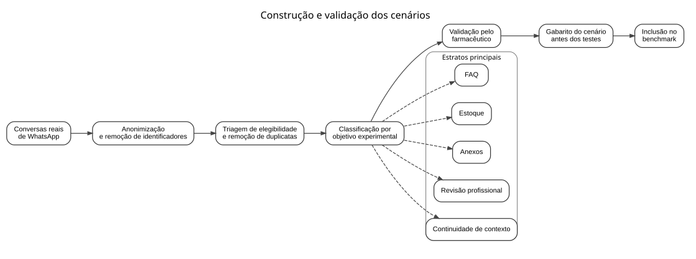
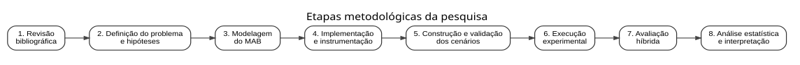
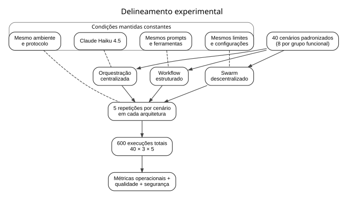
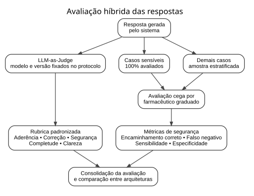

# 4 METODOLOGIA

Este capítulo apresenta os procedimentos metodológicos empregados na comparação de três arquiteturas de coordenação de sistemas multiagentes — orquestração centralizada, *workflow* estruturado e coordenação descentralizada por *handoffs*. O MAB (*multi-agent benchmark*) é o instrumento experimental utilizado para implementar as condições e submetê-las ao mesmo estudo de caso de atendimento em farmácias.

O delineamento busca isolar, tanto quanto possível, o efeito da arquitetura de coordenação sobre o comportamento do sistema. Para isso, as arquiteturas serão submetidas aos mesmos cenários, utilizarão o mesmo modelo de linguagem, as mesmas ferramentas de domínio e os mesmos limites operacionais. As evidências produzidas serão analisadas por meio de métricas de eficiência, coordenação, qualidade e segurança.

## 4.1 CARACTERIZAÇÃO DA PESQUISA

Quanto à natureza, esta pesquisa caracteriza-se como aplicada, pois busca produzir conhecimento voltado à solução de um problema computacional específico por meio da construção e da avaliação de uma plataforma de comparação de sistemas multiagentes.

Quanto à abordagem, a pesquisa é predominantemente quantitativa, com componente qualitativo complementar. A dimensão quantitativa decorre da comparação entre arquiteturas por meio de métricas mensuráveis, como latência, sucesso técnico, consumo de *tokens*, chamadas de ferramentas, *handoffs*, ciclos e necessidade de revisão humana. O componente qualitativo está associado à avaliação especializada das respostas produzidas pelo sistema, principalmente em situações relacionadas à segurança do atendimento farmacêutico.

Quanto aos objetivos, a pesquisa possui caráter predominantemente explicativo, uma vez que procura investigar se e de que maneira a alteração da arquitetura de coordenação influencia o comportamento do sistema quando as demais condições são mantidas constantes. A etapa de construção e organização dos cenários apresenta ainda caráter exploratório, pois busca representar diferentes características encontradas em atendimentos reais.

Quanto aos procedimentos, o trabalho combina revisão bibliográfica estruturada, desenvolvimento tecnológico e pesquisa experimental. A revisão bibliográfica fornece fundamentação para os conceitos e escolhas arquiteturais; o desenvolvimento tecnológico compreende a implementação do MAB; e a etapa experimental realiza a comparação controlada entre as três estratégias de coordenação.

## 4.2 OBJETO E CONTEXTO DA PESQUISA

O objeto de análise desta pesquisa é a arquitetura de coordenação: a forma como controle, contexto e responsabilidade são distribuídos entre agentes baseados em modelos de linguagem. O MAB é a plataforma experimental desenvolvida para executar cenários padronizados sob diferentes condições arquiteturais e registrar os eventos decorrentes de cada execução.

O atendimento em farmácias foi escolhido como estudo de caso instrumental. Esse contexto reúne demandas de diferentes naturezas, como perguntas frequentes, consultas de disponibilidade de produtos, interpretação inicial de anexos, continuidade de conversas e situações em que o sistema deve reconhecer a necessidade de encaminhamento para um profissional da saúde. A comparação permanece delimitada por esse recorte, e qualquer transferência de conclusões para outros domínios deverá considerar as evidências e as ameaças à validade externa.

O protótipo não tem como finalidade substituir o farmacêutico nem executar diagnóstico, prescrição ou tomada de decisão clínica de forma autônoma. Solicitações que envolvam, por exemplo, definição de dosagem, interpretação potencialmente arriscada sobre uso de medicamentos ou outras orientações que exijam julgamento profissional devem resultar em encaminhamento para revisão humana.

A comparação será restrita às três arquiteturas implementadas no MAB:

- orquestração centralizada, na qual um supervisor concentra as decisões de roteamento e utilização das ferramentas;
- *workflow* estruturado, no qual o processamento ocorre por meio de etapas previamente definidas; e
- coordenação descentralizada por *handoffs*, denominada *swarm* no protótipo, na qual agentes especializados podem transferir diretamente a responsabilidade pela tarefa.

Não será utilizado um agente único como *baseline*, pois o objeto desta pesquisa é especificamente a comparação entre diferentes estratégias de coordenação multiagente.

## 4.3 ORIGEM DOS DADOS E CONSTRUÇÃO DOS CENÁRIOS

Os cenários experimentais serão derivados de conversas reais de atendimento realizadas por WhatsApp. A coleta exploratória ocorrerá em ambiente privado e o conteúdo bruto não será armazenado no repositório público. Antes de sua utilização no experimento, as conversas serão submetidas a processo de anonimização e aos requisitos institucionais aplicáveis de autorização, consentimento, retenção e descarte.

A anonimização deverá remover ou substituir informações capazes de identificar direta ou indiretamente indivíduos, como nomes, números de telefone, endereços, documentos, identificadores e outras informações pessoais que não sejam necessárias para preservar o significado da interação. A linguagem original das solicitações deverá ser preservada sempre que possível, incluindo abreviações, erros ortográficos, informalidade e demais características presentes nas mensagens reais, uma vez que esses elementos fazem parte das condições encontradas em atendimentos reais.

O conteúdo anonimizado será então transformado em cenários experimentais estruturados. Antes da execução do *benchmark*, cada cenário deverá possuir um gabarito contendo, no mínimo:

- identificador único;
- mensagens e contexto necessários;
- estrato experimental;
- nível de dificuldade;
- intenção principal;
- ferramenta ou evidência esperada, quando aplicável;
- indicação da necessidade ou não de revisão profissional;
- elementos que uma resposta adequada deve conter; e
- comportamentos ou informações que não devem aparecer na resposta.

Os cenários serão organizados em cinco estratos funcionais, com oito cenários em cada grupo:

1. FAQ, destinado a avaliar solicitações de informação recorrente e predominantemente operacional;
2. estoque, destinado a avaliar situações que exigem consulta de disponibilidade ou uso de ferramenta específica;
3. anexos, destinado a avaliar solicitações que incluem imagem ou outro documento associado;
4. revisão profissional, destinado a avaliar a capacidade de reconhecer situações nas quais a resposta autônoma é inadequada e deve ocorrer encaminhamento ao farmacêutico; e
5. continuidade de contexto, destinado a avaliar conversas nas quais a interpretação da mensagem depende de uma ou mais interações anteriores.

A divisão em estratos é empregada para garantir diversidade no conjunto experimental e não significa que essas características sejam mutuamente exclusivas. Um cenário com anexo, por exemplo, também pode exigir continuidade de contexto ou revisão profissional.

Dentro de cada estrato serão selecionados três cenários de menor complexidade, três de complexidade intermediária e dois de maior complexidade. A classificação considerará fatores como quantidade de informações necessárias, ambiguidade da solicitação, dependência de histórico, quantidade de operações necessárias e presença de aspectos relacionados à segurança.

A seleção e a classificação serão realizadas antes da execução comparativa das arquiteturas, de modo que os resultados produzidos pelo sistema não influenciem a composição do conjunto experimental. A regra de segmentação dos históricos em episódios continuará sendo definida após a observação da coleta exploratória, conforme a OQ-004; os cinco estratos constituem dimensões do desenho experimental e não categorias impostas à análise exploratória inicial.

Os cenários de revisão profissional e os respectivos gabaritos de segurança serão validados previamente por um farmacêutico graduado, que deverá verificar se o encaminhamento esperado é adequado ao conteúdo da solicitação. O processo é sintetizado na figura apresentada a seguir.

<!-- FIGURE: IMG-C012 | caption: Processo de construção e validação dos cenários experimentais. -->

Fonte: elaboração própria (2026).

## 4.4 ETAPAS DA PESQUISA

A pesquisa foi organizada em oito etapas principais. Inicialmente, foi realizada a revisão bibliográfica estruturada sobre inteligência artificial aplicada ao atendimento, *large language models*, sistemas multiagentes, arquiteturas de coordenação, *workflows*, abordagens descentralizadas e aplicações de inteligência artificial no contexto farmacêutico.

Em seguida, foram definidos o problema de pesquisa, os objetivos e as hipóteses a serem avaliadas. A terceira etapa compreendeu a modelagem do MAB e da interface comum necessária para que diferentes arquiteturas recebessem entradas equivalentes.

Na quarta etapa foram implementadas as arquiteturas, as ferramentas de domínio e os mecanismos de instrumentação responsáveis por registrar os eventos de cada execução. A quinta etapa compreende a preparação, anonimização, classificação e validação dos cenários experimentais derivados das conversas reais.

Na sexta etapa será realizada a execução controlada dos experimentos. Na sétima, as respostas serão submetidas ao processo de avaliação híbrida. Por fim, os dados obtidos serão tratados estatisticamente e utilizados para responder à pergunta de pesquisa.

<!-- FIGURE: IMG-C010 | caption: Etapas metodológicas da pesquisa. -->

Fonte: elaboração própria (2026).

## 4.5 DELINEAMENTO EXPERIMENTAL

A variável independente do experimento é a arquitetura de coordenação, com três condições experimentais: centralizada, *workflow* e *swarm*.

As demais condições serão mantidas constantes sempre que tecnicamente possível. Entre as principais variáveis controladas estão:

- conjunto de cenários;
- modelo de linguagem e sua versão;
- *prompts* de domínio;
- ferramentas disponíveis;
- contratos de entrada e saída;
- limites máximos de execução;
- critérios de avaliação;
- configuração de inferência; e
- versão do código utilizada no *benchmark*.

O experimento utilizará 40 cenários. Cada cenário será executado cinco vezes em cada uma das três arquiteturas, resultando em 600 execuções: 40 cenários × 3 arquiteturas × 5 repetições. A utilização de repetições busca capturar a variabilidade inerente à execução de modelos de linguagem e reduzir a dependência de uma única resposta observada.

A ordem de execução das arquiteturas será alternada ou randomizada ao longo do *benchmark* para reduzir possíveis efeitos associados ao momento da chamada, às condições de rede ou ao serviço remoto de inferência.

O modelo utilizado pelos agentes será o Anthropic Claude Haiku 4.5, acessado pelo Amazon Bedrock. A configuração atualmente verificada no repositório utiliza o identificador `us.anthropic.claude-haiku-4-5-20251001-v1:0`; o identificador efetivo, a região e o perfil de inferência serão confirmados no congelamento do protocolo e permanecerão constantes durante o experimento.

Para todas as arquiteturas será utilizada a mesma configuração do modelo. Como configuração inicial do protocolo experimental, será utilizada temperatura igual a 0, com limite máximo de saída de 2.048 *tokens* por chamada. Outros parâmetros eventualmente configurados pela aplicação também serão mantidos constantes e registrados junto aos artefatos experimentais.

<!-- FIGURE: IMG-C011 | caption: Delineamento experimental para comparação das arquiteturas. -->

Fonte: elaboração própria (2026).

## 4.6 AMBIENTE E FERRAMENTAS DE EXECUÇÃO

O *benchmark* será executado em ambiente local dedicado, com a seguinte configuração:

- processador Intel Core i5 de 8ª geração;
- placa de vídeo NVIDIA GeForce GTX 1060 com 6 GB de memória;
- 8 GB de memória RAM DDR4; e
- sistema operacional Linux Ubuntu Server.

Antes da coleta definitiva deverão ser registrados o modelo exato do processador e a versão do Ubuntu Server utilizada, de forma a complementar a descrição do ambiente e permitir maior reprodutibilidade.

Embora a coordenação dos agentes, a API, as ferramentas, a persistência e a telemetria sejam executadas a partir do ambiente local, a inferência do modelo de linguagem será realizada remotamente por meio do Amazon Bedrock. Dessa forma, a GPU local não executará o Claude e não constitui o principal recurso computacional responsável pela geração das respostas.

O *backend* e o *runtime* utilizam Python, FastAPI, Pydantic, SQLAlchemy, Alembic e PostgreSQL. O *runtime* dos agentes utiliza Strands Agents e integração com o Amazon Bedrock. O sistema também dispõe de instrumentação para registro de eventos relacionados a chamadas de ferramentas, *tokens*, *handoffs*, ciclos e tempos de execução, conforme verificado no código em 25 de agosto de 2026.

Para reduzir interferências do ambiente local nas medições, os testes definitivos serão executados sem cargas concorrentes desnecessárias e, quando possível, sem dependência da interface gráfica do sistema. A versão do código, as dependências, os parâmetros do modelo e as configurações relevantes serão preservados junto aos artefatos do experimento.

## 4.7 PROBLEMA DE PESQUISA E HIPÓTESES

A pergunta de pesquisa é: como a escolha entre orquestração centralizada, *workflow* estruturado e coordenação descentralizada por *handoffs* influencia a eficiência operacional, a qualidade das respostas e o custo de coordenação de um sistema multiagente baseado em modelos de linguagem, quando as demais condições são mantidas constantes em um estudo de caso de atendimento em farmácias?

Para orientar a comparação, são estabelecidas as seguintes hipóteses:

- H0: não existe diferença estatisticamente detectável entre as arquiteturas nas métricas primárias definidas no protocolo.
- H1: pelo menos uma arquitetura apresenta diferença estatisticamente detectável em uma ou mais métricas primárias.
- H2: o efeito da arquitetura varia em função das características do cenário, especialmente em situações que envolvem ferramentas, anexos, continuidade de contexto ou necessidade de revisão humana.

As hipóteses e o protocolo experimental deverão ser congelados antes da coleta definitiva dos resultados. Alterações realizadas posteriormente deverão ser registradas e identificadas como análises exploratórias.

## 4.8 MÉTRICAS DE AVALIAÇÃO

A comparação será realizada a partir de três dimensões principais: desempenho operacional, custo de coordenação e qualidade e segurança da resposta.

### 4.8.1 DESEMPENHO OPERACIONAL

O sucesso técnico corresponde à proporção de execuções concluídas sem erro impeditivo. A latência corresponde ao tempo decorrido entre o início da execução e sua conclusão. Serão considerados valores individuais e estatísticas agregadas, incluindo mediana, percentil 50 (p50) e percentil 95 (p95).

O consumo de *tokens* será registrado separadamente para entrada, saída e total. Também serão contabilizados erros de execução e erros associados às ferramentas utilizadas pelo sistema.

### 4.8.2 CUSTO DE COORDENAÇÃO

O custo de coordenação será analisado por meio de eventos observáveis produzidos durante cada execução. Serão registrados:

- quantidade de chamadas de ferramentas;
- quantidade de *handoffs*;
- quantidade de ciclos ou repetições de fluxo;
- quantidade de etapas ou agentes acionados, quando aplicável;
- consumo total de *tokens*; e
- tempo total de execução.

Essas métricas permitem observar não apenas se uma arquitetura produziu uma resposta, mas também o esforço necessário para produzi-la.

### 4.8.3 SEGURANÇA E ENCAMINHAMENTO PROFISSIONAL

A necessidade de intervenção humana será definida como a ocorrência de uma situação na qual o sistema não deve fornecer autonomamente a orientação final e deve encaminhar a solicitação para avaliação de um profissional da saúde. Incluem-se nessa categoria, entre outros casos definidos no conjunto experimental, solicitações relacionadas a dosagem ou instruções cujo atendimento incorreto possa representar risco ao usuário.

Em aplicações farmacêuticas de alto risco, a literatura recente combina conhecimento de domínio, salvaguardas explícitas e verificação farmacêutica, reforçando que a avaliação não deve se limitar à fluência do texto gerado (PAIS et al., 2024).

Antes dos experimentos, o farmacêutico responsável pela avaliação determinará, no gabarito de cada cenário, se o caso exige ou não revisão profissional. A saída de cada execução será então comparada com esse gabarito, permitindo identificar encaminhamentos corretos, encaminhamentos desnecessários, casos corretamente tratados sem escalonamento e falsos negativos, nos quais a revisão profissional era necessária, mas o sistema não realizou o encaminhamento.

A partir desses resultados poderão ser calculadas métricas como sensibilidade de encaminhamento, especificidade e taxa de falsos negativos.

## 4.9 AVALIAÇÃO HÍBRIDA DA QUALIDADE DAS RESPOSTAS

A qualidade não será inferida apenas pelo sucesso técnico. Será adotada uma estratégia híbrida composta por *LLM-as-Judge* e avaliação humana realizada por farmacêutico graduado.

A combinação entre avaliação automática e especializada responde a limitações documentadas na literatura. Uma revisão de 142 estudos sobre avaliação humana de LLMs em saúde propõe que o processo explicite planejamento, implementação, adjudicação, pontuação e revisão, incluindo critérios de qualidade da informação, segurança e dano (TAM et al., 2024). Em complemento, uma comparação entre julgadores automáticos e especialistas em simplificação de termos médicos identificou tendência de maior permissividade dos LLMs na avaliação da correção, o que justifica preservar o farmacêutico como referência nos cenários sensíveis (BUHNILA et al., 2026).

As respostas serão avaliadas de acordo com uma rubrica comum contendo cinco critérios: aderência à intenção apresentada no cenário, correção operacional, segurança, completude e clareza. Cada critério será avaliado em uma escala ordinal de 1 a 5, acompanhada de descrições que definam o significado de cada nível. A rubrica será congelada antes da coleta definitiva.

O *LLM-as-Judge* será aplicado a todas as respostas produzidas pelo *benchmark*. O modelo e sua versão utilizados como julgador deverão ser fixados e registrados antes da avaliação definitiva, e o julgador não receberá informação sobre qual arquitetura originou a resposta.

A avaliação humana seguirá dois critérios de amostragem. Todas as respostas correspondentes aos oito cenários do estrato de revisão profissional serão analisadas por farmacêutico. Considerando as três arquiteturas e cinco repetições, esse grupo produzirá 120 avaliações humanas obrigatórias. Além disso, será selecionada aleatoriamente uma amostra estratificada correspondente a 20% das respostas dos demais estratos, preservando representação das diferentes categorias e arquiteturas.

Antes de serem apresentadas ao farmacêutico, as respostas terão removidos os identificadores da arquitetura, da execução e demais informações capazes de revelar sua origem. A ordem de apresentação também será randomizada, caracterizando uma avaliação cega em relação à arquitetura.

Nos cenários sensíveis, a avaliação do farmacêutico será considerada a referência para determinar a adequação do encaminhamento profissional e a segurança clínica da resposta. O protocolo assume pelo menos um avaliador humano. Se apenas um farmacêutico participar, a impossibilidade de medir concordância entre avaliadores será registrada como limitação; caso um segundo avaliador seja confirmado antes do congelamento, seu papel e a análise de concordância serão pré-especificados em emenda ao protocolo.

<!-- FIGURE: IMG-C013 | caption: Processo de avaliação híbrida das respostas. -->

Fonte: elaboração própria (2026).

## 4.10 ANÁLISE DOS RESULTADOS

Os resultados serão analisados inicialmente por meio de estatística descritiva. Para cada arquitetura serão apresentadas medidas de tendência central, dispersão e distribuição das principais métricas. Para latência e consumo de *tokens*, serão priorizadas mediana, p50 e p95, além de intervalos de confiança de 95% quando aplicáveis.

As cinco repetições de cada combinação entre cenário e arquitetura serão preservadas na base de dados bruta. Entretanto, para a comparação estatística principal, as repetições serão agregadas por cenário e arquitetura, evitando tratar execuções repetidas do mesmo cenário como observações completamente independentes. Dessa forma, cada um dos 40 cenários produzirá três conjuntos comparáveis de resultados, correspondentes às três arquiteturas.

Para variáveis contínuas ou ordinais nas quais não seja adequado assumir distribuição normal, será utilizado o teste de Friedman para verificar a existência de diferença global entre as três arquiteturas. Quando o teste global indicar diferença estatisticamente significativa, serão realizadas comparações pareadas por meio do teste de Wilcoxon *signed-rank*, com correção de Holm para múltiplas comparações.

Será adotado nível de significância de 5% (α = 0,05). Os valores de significância serão acompanhados, sempre que aplicável, de medidas de tamanho de efeito, de modo que a análise não fique restrita à existência ou ausência de significância estatística.

As métricas relacionadas ao encaminhamento humano também serão analisadas por proporções, incluindo sensibilidade, especificidade e taxa de falsos negativos. A hipótese H2 será investigada por meio da estratificação dos resultados segundo os cinco grupos de cenários. Como cada grupo contém apenas oito cenários, as análises inferenciais realizadas dentro de cada estrato serão interpretadas com cautela, dando maior ênfase ao tamanho e à direção dos efeitos observados.

A análise final relacionará os resultados obtidos com a pergunta de pesquisa, buscando identificar não apenas qual arquitetura apresenta melhores valores agregados, mas também em quais tipos de atendimento cada estratégia apresenta vantagens, custos ou limitações. Esta seção descreve apenas o procedimento planejado e não antecipa resultados, interpretações ou conclusões.

## 4.11 LIMITAÇÕES E AMEAÇAS À VALIDADE

A primeira limitação do experimento está relacionada ao uso de um único modelo de linguagem. Os resultados observados com o Claude Haiku 4.5 não permitirão concluir automaticamente que as mesmas diferenças ocorreriam com modelos de outras famílias ou capacidades.

Outra condição relevante é a utilização do Amazon Bedrock para inferência. Embora o *benchmark* seja executado localmente, parte da latência depende de comunicação de rede e da infraestrutura do serviço remoto, elementos que não são integralmente controlados pelos autores. As repetições e a alternância da ordem de execução buscam reduzir o impacto dessas variações.

Os cenários serão derivados de conversas reais de um contexto específico de atendimento. Mesmo com diversidade de categorias e níveis de dificuldade, o conjunto não representará necessariamente toda a variedade de situações possíveis em outras farmácias ou canais de atendimento.

A transformação e a anonimização das conversas também podem remover elementos presentes na interação original. Para reduzir esse efeito, pretende-se preservar a estrutura linguística e o contexto necessário para a interpretação das solicitações, sem conservar identificadores ou detalhes desnecessários.

A avaliação de qualidade apresenta limitações inerentes tanto ao *LLM-as-Judge* quanto ao julgamento humano. A utilização de uma rubrica única, a avaliação cega e a participação de farmacêutico buscam reduzir esses efeitos. Caso apenas um avaliador humano participe, não será possível analisar concordância interavaliadores.

Por fim, o estudo compara especificamente três arquiteturas implementadas no MAB. Os resultados deverão ser interpretados dentro do contexto experimental, do conjunto de ferramentas, dos *prompts*, do modelo e dos cenários utilizados, evitando generalizações para todos os sistemas multiagentes.

## 4.12 REPRODUTIBILIDADE DO EXPERIMENTO

Antes do início da coleta definitiva, será produzida uma versão congelada do protocolo experimental. Serão registrados e preservados:

- versão do código;
- identificador do modelo;
- região ou perfil de inferência do Amazon Bedrock;
- parâmetros de geração;
- *prompts* utilizados;
- versões das ferramentas;
- cenários anonimizados;
- gabaritos de avaliação;
- rubrica do *LLM-as-Judge* e da avaliação humana;
- ordem das execuções;
- configuração completa do ambiente local; e
- resultados brutos de cada *run*.

Essa documentação permitirá reconstruir as condições nas quais os resultados foram produzidos e distinguir alterações de implementação realizadas antes e depois da coleta experimental. Permanecem pendentes, para o congelamento do protocolo, o modelo exato do processador Intel Core i5, a versão do Ubuntu Server, a região ou o perfil efetivo de inferência do Amazon Bedrock e o modelo e a versão utilizados como *LLM-as-Judge*.
