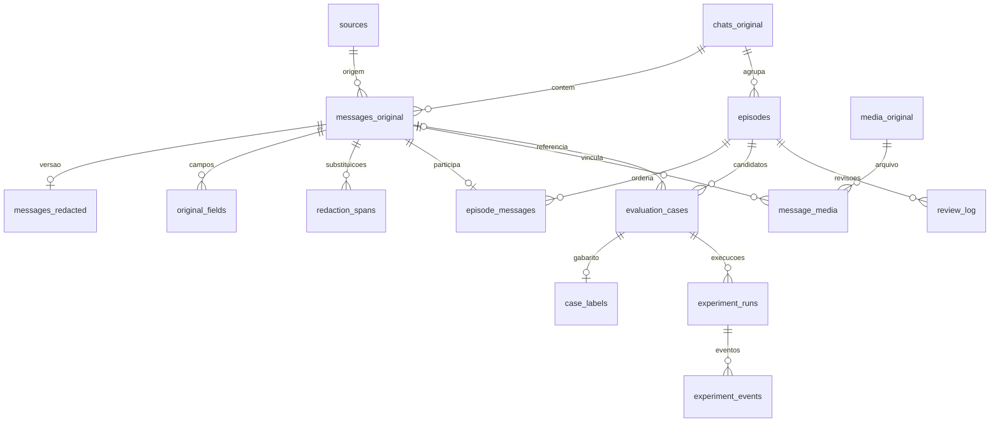

# Schema SQLite — dataset TCC v1.1

Extraído dos arquivos reais, em modo somente leitura. Este documento e os SQLs não contêm mensagens, nomes, telefones, chaves ou valores do mapa reversível.

## Arquivos

- `schema_privado.sql`: 17 tabelas, 2 índices explícitos e 12 gatilhos de proteção de originais.
- `schema_exportacoes.sql`: 5 tabelas e 1 índice explícito; compartilhado pelo banco de candidatos e pelo piloto de agentes.
- `schema_metadata.json`: campos, tipos, chaves, valores padrão e contagens em formato estruturado.

`PK` significa chave primária; `FK`, chave estrangeira. Referências sem coluna explícita apontam para a PK da tabela de destino. Os gatilhos impedem UPDATE/DELETE em seis tabelas originais, mas não são uma fronteira de segurança contra quem controla o arquivo.

## Relacionamentos centrais

O diagrama mostra os relacionamentos principais; `messages_redacted.chat_uid` também referencia `chats_original`. `metadata` e `auxiliary_original` não têm FK.

## Convenções e limites atuais

- Identificadores pseudônimos (`*_uid`) e marcadores de redigência são strings. O mapa e a chave HMAC ficam no domínio restrito.
- Campos `*_json` e `residual_flags` são TEXT com JSON; o esquema atual não impõe `json_valid`.
- Datas UNIX e intervalos relativos são segundos; `latency_ms` e `duration_ms` são milissegundos. Datas de importação/revisão/execução são strings ISO 8601.
- Valores booleanos usam INTEGER; as restrições atuais não impõem CHECK 0/1.
- `split` usa train/dev/test e `review_status` usa pending/approved/held por convenção do pipeline; não há CHECK desses valores no banco.
- `start/end` e `redacted_start/redacted_end` são posições em caracteres Python, início incluso e fim exclusivo. Não são offsets em bytes.
- Os binários dos anexos ficam no ZIP restrito, fora do SQLite. O manifesto inclui recuperados e indisponíveis.
- O esquema exportado não possui FK para os originais: os identificadores relacionam os arquivos somente para o avaliador autorizado.
- No piloto, apenas mensagens até `cases.cut_sequence` estão fisicamente presentes. No banco de candidatos, os episódios estão completos e pendentes de curadoria.
- `case_labels`, `experiment_runs` e `experiment_events` estão vazias. As 892 referências históricas são candidatas, não gabaritos validados.
- `restoration_audit` é criada pelo utilitário quando ocorrer uma restauração explícita; não existe nesta fotografia do banco e não consta no SQL exportado.

## Pontos para planejar a próxima versão

1. **Coleta incremental:** hoje `whatsapp_id` é UNIQUE global e a base contém uma conta. Para múltiplas contas/snapshots, criar accounts, chave `(account_id, whatsapp_id)`, relação mensagem–snapshot e tabela de versões/edições.
2. **Versões de redação:** atualmente há uma versão em messages_redacted por message_uid; o mapa também não tem run_id. Novas execuções ficam em arquivos versionados. Para coexistirem no mesmo banco, adicionar processing_runs e versionar mensagens redigidas/mapas.
3. **Integridade:** adicionar CHECK de enums/booleanos/JSON, NOT NULL explícito às PKs TEXT e restrições para coerência de conversa entre episódio e mensagem. Hoje algumas dessas verificações ficam no código.
4. **Avaliação:** permitir múltiplos anotadores e histórico de rótulos. Atualmente case_labels tem uma linha por caso, apesar de registrar label_version.
5. **Experimentos:** definir unidade de custo/moeda, versões de rubricas e cenários simulados, e política de repetição antes de preencher as métricas.

As alterações acima são propostas; não foram aplicadas ao banco existente.

## Banco restrito

### `metadata`

Configuração e classificação do arquivo.

**Linhas:** 10.

| Campo | Tipo | Chaves / restrições explícitas | Padrão |
|---|---|---|---|
| `key` | TEXT | PK 1 | — |
| `value` | TEXT | NOT NULL | — |

Consultar o SQL para UNIQUE, CHECK e índices compostos.

### `sources`

Proveniência da importação, hash do ZIP e perfil da conta (restrito).

**Linhas:** 1.

| Campo | Tipo | Chaves / restrições explícitas | Padrão |
|---|---|---|---|
| `source_id` | TEXT | PK 1 | — |
| `filename` | TEXT | — | — |
| `sha256` | TEXT | NOT NULL | — |
| `imported_at` | TEXT | NOT NULL | — |
| `profile_json` | TEXT | NOT NULL | — |

Consultar o SQL para UNIQUE, CHECK e índices compostos.

### `chats_original`

Identidade e metadados originais das conversas; group_uid agrupa clientes para particionamento.

**Linhas:** 790.

| Campo | Tipo | Chaves / restrições explícitas | Padrão |
|---|---|---|---|
| `chat_uid` | TEXT | PK 1 | — |
| `whatsapp_id` | TEXT | NOT NULL | — |
| `group_uid` | TEXT | NOT NULL | — |
| `is_group` | INTEGER | NOT NULL | — |
| `raw_json` | TEXT | NOT NULL | — |

Consultar o SQL para UNIQUE, CHECK e índices compostos.

### `messages_original`

Uma mensagem/evento por ID; JSON integral, origem, horário e hash preservados.

**Linhas:** 20.965.

| Campo | Tipo | Chaves / restrições explícitas | Padrão |
|---|---|---|---|
| `message_uid` | TEXT | PK 1 | — |
| `chat_uid` | TEXT | NOT NULL; FK → chats_original.(chave primária) | — |
| `whatsapp_id` | TEXT | NOT NULL | — |
| `source_id` | TEXT | NOT NULL; FK → sources.(chave primária) | — |
| `timestamp_unix` | INTEGER | — | — |
| `from_me` | INTEGER | NOT NULL | — |
| `type` | TEXT | NOT NULL | — |
| `raw_json` | TEXT | NOT NULL | — |
| `raw_sha256` | TEXT | NOT NULL | — |

Consultar o SQL para UNIQUE, CHECK e índices compostos.

### `original_fields`

Texto original separado por campo: body, caption, quoted_text e extra_text. Inclui campos vazios.

**Linhas:** 83.860.

| Campo | Tipo | Chaves / restrições explícitas | Padrão |
|---|---|---|---|
| `message_uid` | TEXT | PK 1; NOT NULL; FK → messages_original.(chave primária) | — |
| `field` | TEXT | PK 2; NOT NULL | — |
| `original_text` | TEXT | NOT NULL | — |

Consultar o SQL para UNIQUE, CHECK e índices compostos.

### `messages_redacted`

Uma versão pseudonimizada por mensagem, com sinalizações e estado de revisão.

**Linhas:** 20.965.

| Campo | Tipo | Chaves / restrições explícitas | Padrão |
|---|---|---|---|
| `message_uid` | TEXT | PK 1; FK → messages_original.(chave primária) | — |
| `chat_uid` | TEXT | NOT NULL; FK → chats_original.(chave primária) | — |
| `role` | TEXT | NOT NULL | — |
| `type` | TEXT | NOT NULL | — |
| `body` | TEXT | NOT NULL | — |
| `caption` | TEXT | NOT NULL | — |
| `quoted_text` | TEXT | NOT NULL | — |
| `extra_text` | TEXT | NOT NULL | — |
| `content_class` | TEXT | NOT NULL | — |
| `redaction_count` | INTEGER | NOT NULL | — |
| `residual_flags` | TEXT | NOT NULL | — |
| `review_status` | TEXT | NOT NULL | 'pending' |
| `pipeline_version` | TEXT | NOT NULL | — |

Consultar o SQL para UNIQUE, CHECK e índices compostos.

### `redaction_spans`

Mapa reversível restrito: posições antes/depois, marcador e trecho original de cada substituição.

**Linhas:** 7.651.

| Campo | Tipo | Chaves / restrições explícitas | Padrão |
|---|---|---|---|
| `message_uid` | TEXT | PK 1; NOT NULL; FK → messages_original.(chave primária) | — |
| `field` | TEXT | PK 2; NOT NULL | — |
| `ordinal` | INTEGER | PK 3; NOT NULL | — |
| `start` | INTEGER | NOT NULL | — |
| `end` | INTEGER | NOT NULL | — |
| `redacted_start` | INTEGER | NOT NULL | — |
| `redacted_end` | INTEGER | NOT NULL | — |
| `kind` | TEXT | NOT NULL | — |
| `detector` | TEXT | NOT NULL | — |
| `token` | TEXT | NOT NULL | — |
| `original_value` | TEXT | NOT NULL | — |

Consultar o SQL para UNIQUE, CHECK e índices compostos.

### `episodes`

Agrupamento heurístico das mensagens em episódios de atendimento.

**Linhas:** 1.672.

| Campo | Tipo | Chaves / restrições explícitas | Padrão |
|---|---|---|---|
| `episode_uid` | TEXT | PK 1 | — |
| `chat_uid` | TEXT | NOT NULL; FK → chats_original.(chave primária) | — |
| `group_uid` | TEXT | NOT NULL | — |
| `split` | TEXT | NOT NULL | — |
| `category_hint` | TEXT | NOT NULL | — |
| `review_status` | TEXT | NOT NULL | 'pending' |
| `start_unix` | INTEGER | — | — |
| `end_unix` | INTEGER | — | — |
| `message_count` | INTEGER | NOT NULL | — |
| `media_count` | INTEGER | NOT NULL | — |
| `is_group` | INTEGER | NOT NULL | — |

Consultar o SQL para UNIQUE, CHECK e índices compostos.

### `episode_messages`

Ordem das mensagens e tempo relativo dentro do episódio.

**Linhas:** 20.965.

| Campo | Tipo | Chaves / restrições explícitas | Padrão |
|---|---|---|---|
| `episode_uid` | TEXT | PK 1; NOT NULL; FK → episodes.(chave primária) | — |
| `message_uid` | TEXT | NOT NULL; FK → messages_original.(chave primária) | — |
| `sequence` | INTEGER | PK 2; NOT NULL | — |
| `elapsed_seconds` | INTEGER | NOT NULL | — |

Consultar o SQL para UNIQUE, CHECK e índices compostos.

### `media_original`

Manifesto JSON de cada mídia, incluindo anexos indisponíveis. Não armazena o binário.

**Linhas:** 1.975.

| Campo | Tipo | Chaves / restrições explícitas | Padrão |
|---|---|---|---|
| `media_uid` | TEXT | PK 1 | — |
| `manifest_json` | TEXT | NOT NULL | — |

Consultar o SQL para UNIQUE, CHECK e índices compostos.

### `message_media`

Relação muitos-para-muitos entre mensagens e mídias deduplicadas.

**Linhas:** 2.104.

| Campo | Tipo | Chaves / restrições explícitas | Padrão |
|---|---|---|---|
| `message_uid` | TEXT | PK 1; NOT NULL; FK → messages_original.(chave primária) | — |
| `media_uid` | TEXT | PK 2; NOT NULL; FK → media_original.(chave primária) | — |

Consultar o SQL para UNIQUE, CHECK e índices compostos.

### `auxiliary_original`

JSONs originais de reações e associações entre mensagens.

**Linhas:** 679.

| Campo | Tipo | Chaves / restrições explícitas | Padrão |
|---|---|---|---|
| `kind` | TEXT | PK 1; NOT NULL | — |
| `ordinal` | INTEGER | PK 2; NOT NULL | — |
| `raw_json` | TEXT | NOT NULL | — |

Consultar o SQL para UNIQUE, CHECK e índices compostos.

### `review_log`

Histórico das decisões de revisão do episódio.

**Linhas:** 8.

| Campo | Tipo | Chaves / restrições explícitas | Padrão |
|---|---|---|---|
| `id` | INTEGER | PK 1 | — |
| `episode_uid` | TEXT | NOT NULL; FK → episodes.(chave primária) | — |
| `decision` | TEXT | NOT NULL | — |
| `reviewer` | TEXT | NOT NULL | — |
| `note` | TEXT | NOT NULL | — |
| `reviewed_at` | TEXT | NOT NULL | — |

Consultar o SQL para UNIQUE, CHECK e índices compostos.

### `evaluation_cases`

Candidatos a testes; corte da entrada e mensagem posterior de referência fraca.

**Linhas:** 892.

| Campo | Tipo | Chaves / restrições explícitas | Padrão |
|---|---|---|---|
| `case_uid` | TEXT | PK 1 | — |
| `episode_uid` | TEXT | NOT NULL; FK → episodes.(chave primária) | — |
| `cut_sequence` | INTEGER | NOT NULL | — |
| `reference_message_uid` | TEXT | FK → messages_original.(chave primária) | — |
| `label_status` | TEXT | NOT NULL | 'weak_reference_not_ground_truth' |

Consultar o SQL para UNIQUE, CHECK e índices compostos.

### `experiment_runs`

Uma execução de arquitetura por caso; métricas e versões; ainda vazio.

**Linhas:** 0.

| Campo | Tipo | Chaves / restrições explícitas | Padrão |
|---|---|---|---|
| `run_uid` | TEXT | PK 1 | — |
| `case_uid` | TEXT | NOT NULL; FK → evaluation_cases.(chave primária) | — |
| `architecture` | TEXT | NOT NULL | — |
| `model` | TEXT | NOT NULL | — |
| `seed` | INTEGER | NOT NULL | — |
| `prompt_version` | TEXT | NOT NULL | — |
| `tools_version` | TEXT | NOT NULL | — |
| `dataset_sha256` | TEXT | NOT NULL | — |
| `latency_ms` | REAL | — | — |
| `input_tokens` | INTEGER | — | — |
| `output_tokens` | INTEGER | — | — |
| `tool_calls` | INTEGER | — | — |
| `handoffs` | INTEGER | — | — |
| `resolved` | INTEGER | — | — |
| `human_intervention` | INTEGER | — | — |
| `cost` | REAL | — | — |
| `redacted_output` | TEXT | — | — |
| `created_at` | TEXT | NOT NULL | — |

Consultar o SQL para UNIQUE, CHECK e índices compostos.

### `experiment_events`

Eventos por agente dentro de uma execução; ainda vazio.

**Linhas:** 0.

| Campo | Tipo | Chaves / restrições explícitas | Padrão |
|---|---|---|---|
| `run_uid` | TEXT | PK 1; NOT NULL; FK → experiment_runs.(chave primária) | — |
| `sequence` | INTEGER | PK 2; NOT NULL | — |
| `agent_role` | TEXT | NOT NULL | — |
| `event_type` | TEXT | NOT NULL | — |
| `duration_ms` | REAL | — | — |
| `payload_redacted_json` | TEXT | — | — |

Consultar o SQL para UNIQUE, CHECK e índices compostos.

### `case_labels`

Gabarito anotado e versionado por caso; ainda vazio.

**Linhas:** 0.

| Campo | Tipo | Chaves / restrições explícitas | Padrão |
|---|---|---|---|
| `case_uid` | TEXT | PK 1; FK → evaluation_cases.(chave primária) | — |
| `expected_intent` | TEXT | — | — |
| `expected_tool` | TEXT | — | — |
| `needs_professional` | INTEGER | — | — |
| `expected_resolution` | TEXT | — | — |
| `reviewer` | TEXT | NOT NULL | — |
| `label_version` | TEXT | NOT NULL | — |

Consultar o SQL para UNIQUE, CHECK e índices compostos.

## Esquema das exportações

### `metadata`

Configuração e classificação do arquivo.

**Linhas:** 2 no piloto; 2 nos candidatos.

| Campo | Tipo | Chaves / restrições explícitas | Padrão |
|---|---|---|---|
| `key` | TEXT | PK 1 | — |
| `value` | TEXT | NOT NULL | — |

Consultar o SQL para UNIQUE, CHECK e índices compostos.

### `conversations`

Identificador pseudônimo da conversa, partição e indicação de grupo.

**Linhas:** 7 no piloto; 790 nos candidatos.

| Campo | Tipo | Chaves / restrições explícitas | Padrão |
|---|---|---|---|
| `conversation_id` | TEXT | PK 1 | — |
| `split` | TEXT | NOT NULL | — |
| `is_group` | INTEGER | NOT NULL | — |

Consultar o SQL para UNIQUE, CHECK e índices compostos.

### `episodes`

Agrupamento heurístico das mensagens em episódios de atendimento.

**Linhas:** 7 no piloto; 1.672 nos candidatos.

| Campo | Tipo | Chaves / restrições explícitas | Padrão |
|---|---|---|---|
| `episode_id` | TEXT | PK 1 | — |
| `conversation_id` | TEXT | NOT NULL; FK → conversations.(chave primária) | — |
| `split` | TEXT | NOT NULL | — |
| `category_hint` | TEXT | NOT NULL | — |
| `review_status` | TEXT | NOT NULL | — |
| `message_count` | INTEGER | NOT NULL | — |
| `media_count` | INTEGER | NOT NULL | — |

Consultar o SQL para UNIQUE, CHECK e índices compostos.

### `cases`

Identificador do caso, episódio e última sequência permitida na entrada.

**Linhas:** 7 no piloto; 892 nos candidatos.

| Campo | Tipo | Chaves / restrições explícitas | Padrão |
|---|---|---|---|
| `case_id` | TEXT | PK 1 | — |
| `episode_id` | TEXT | NOT NULL; FK → episodes.(chave primária) | — |
| `cut_sequence` | INTEGER | NOT NULL | — |

Consultar o SQL para UNIQUE, CHECK e índices compostos.

### `messages`

Textos pseudonimizados, papel, tipo, sequência e tempo relativo; sem originais nem mapa reversível.

**Linhas:** 19 no piloto; 20.965 nos candidatos.

| Campo | Tipo | Chaves / restrições explícitas | Padrão |
|---|---|---|---|
| `message_id` | TEXT | PK 1 | — |
| `episode_id` | TEXT | NOT NULL; FK → episodes.(chave primária) | — |
| `sequence` | INTEGER | NOT NULL | — |
| `elapsed_seconds` | INTEGER | NOT NULL | — |
| `role` | TEXT | NOT NULL | — |
| `type` | TEXT | NOT NULL | — |
| `body` | TEXT | NOT NULL | — |
| `caption` | TEXT | NOT NULL | — |
| `quoted_text` | TEXT | NOT NULL | — |
| `extra_text` | TEXT | NOT NULL | — |
| `content_class` | TEXT | NOT NULL | — |
| `redaction_count` | INTEGER | NOT NULL | — |

Consultar o SQL para UNIQUE, CHECK e índices compostos.
